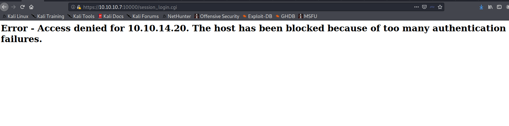

# Information Gathering

## Nmap
We begin our reconnaissance by running an Nmap scan checking default scripts and testing for vulnerabilities.

```console
root@kali:~# nmap 10.10.10.7
Starting Nmap 7.80 ( https://nmap.org ) at 2020-04-01 03:56 EDT
Nmap scan report for 10.10.10.7
Host is up (0.27s latency).
Not shown: 988 closed ports
PORT      STATE SERVICE
22/tcp    open  ssh
25/tcp    open  smtp
80/tcp    open  http
110/tcp   open  pop3
111/tcp   open  rpcbind
143/tcp   open  imap
443/tcp   open  https
993/tcp   open  imaps
995/tcp   open  pop3s
3306/tcp  open  mysql
4445/tcp  open  upnotifyp
10000/tcp open  snet-sensor-mgmt
```

```console
root@kali:~# nmap -sU 10.10.10.7
Starting Nmap 7.80 ( https://nmap.org ) at 2020-03-31 12:37 EDT
Stats: 0:02:00 elapsed; 0 hosts completed (1 up), 1 undergoing UDP Scan
UDP Scan Timing: About 13.90% done; ETC: 12:52 (0:12:23 remaining)
Stats: 0:14:17 elapsed; 0 hosts completed (1 up), 1 undergoing UDP Scan
UDP Scan Timing: About 82.75% done; ETC: 12:54 (0:02:59 remaining)
Nmap scan report for 10.10.10.7
Host is up (0.35s latency).
Not shown: 994 closed ports
PORT      STATE         SERVICE
69/udp    open|filtered tftp
111/udp   open          rpcbind
123/udp   open          ntp
5000/udp  open|filtered upnp
5060/udp  open|filtered sip
10000/udp open          ndmp
```

Here there's something about port **10000**. Let's try to visit the page


{**Figure 1:** Port 10000)
 
We try to login with some guessable passwords, 'admin', 'admin123' etc with username as admin.
 
It can be seen that after a few tries we get locked out and also there's this 'session_login.cgi' happening on the url. This is interesting and could be vulnerable to shell shock. Let's try to check if it really is vulnerable to shellshock.
 


{**Figure 2:** Session_login.cgi)

# Exploitation  

Forward the traffic to burp suite proxy, forward the response to repeater.


{**Figure 3:** Repeater)

Input the shellshock bash reverse shell code to the User-Agent field.


{**Figure 4:**)
 
Listen on the port '1234' using netcat to catch the reverse shell.


{**Figure 5:** Netcat listener)

Send the request with our crafted code to the machine, we get a reverseshell on netcat.


{**Figure 6:** Shell)

This is a root shell.

## User Flag

```
cd home	
l[root@beep home]# s
fanis
spamfilter
c[root@beep home]#cd fanis
[root@beep fanis]# ls
user.txt

```

## Root Flag
```
root@beep ~]# ls
anaconda-ks.cfg
elastix-pr-2.2-1.i386.rpm
install.log
install.log.syslog
postnochroot
root.txt
webmin-1.570-1.noarch.rpm
```

# Conclusion
Shellshock vulnerability in this box is really nice to exploit.

