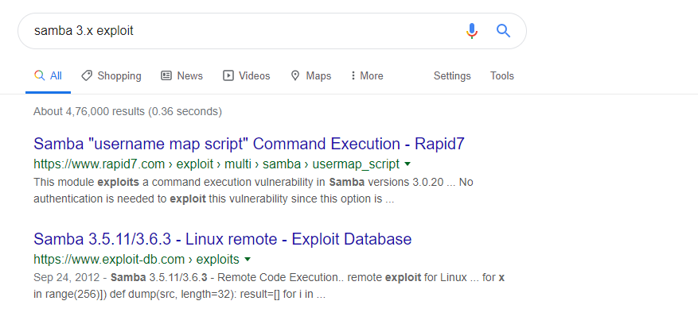
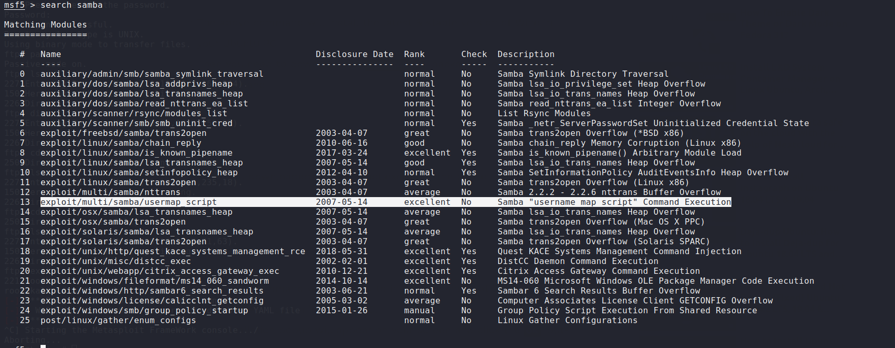
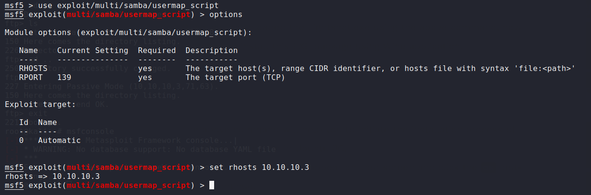
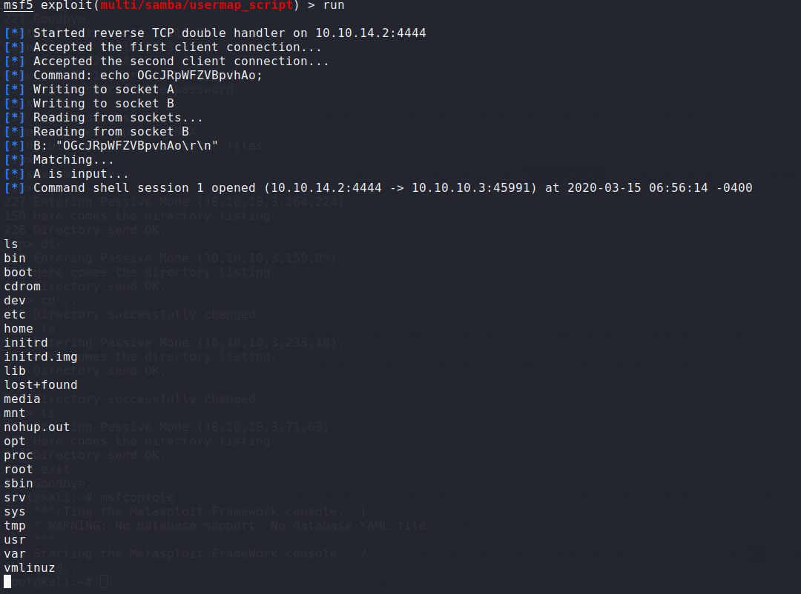

# Information Gathering

## Nmap
Running an Nmap scan.

```console
root@kali:~$ nmap -sV 10.10.10.3

Starting Nmap 7.80 ( https://nmap.org ) at 2020-03-15 12:16 EDT
Nmap scan report for 10.10.10.3
Host is up (0.22s latency).
Not shown: 996 filtered ports
PORT    STATE SERVICE     VERSION
21/tcp  open  ftp         vsftpd 2.3.4
22/tcp  open  ssh         OpenSSH 4.7p1 Debian 8ubuntu1 (protocol 2.0)
139/tcp open  netbios-ssn Samba smbd 3.X - 4.X (workgroup: WORKGROUP)
445/tcp open  netbios-ssn Samba smbd 3.X - 4.X (workgroup: WORKGROUP)
Service Info: OSs: Unix, Linux; CPE: cpe:/o:linux:linux_kernel


```
From the above output we can see that ports, **21**, **52**, **139**, and **445** are open.

Since ftp is open, we could check if anonymous ftp is allowed.


**Figure 1:** FTP Anonymous Login Possible

Anonymous login is possible but directory is not listed.

Next, checking if Samba version running on port 139 is vulnerable.


**Figure 2:** Samba version vulnerable to command execution.


# Exploitation  

Google reveals that there's a metasploit module for the vulnerability. Going ahead and starting msfconsole and searching for samba.


**Figure 3:** Samba usermap_script command exec.

We're using usermap_script command exec module. Going further and inputting RHOST value of our machine 10.10.10.3.


**Figure 4:** Msfconsole.

We run the module after providing RHOSTS value to the IP of machine, and we got a session open.


**Figure 5:** Opened Session.

## User Flag

In order to get the user flag, we change the directory to the user 'makis' and we simply need to use `cat` to read the contents of user.txt
```
root@kali:~$ cat user.txt

```

## Root Flag

There's no need to privesc this box as we could easily change directory to the root folder and `cat` the root.txt
```
root@kali:~$ cat root.txt

```

# Conclusion
Overall the box was pretty easy as the exploits were straight forward and there was no need for a privesc. Both root and user could be owned in less than 10mins.

